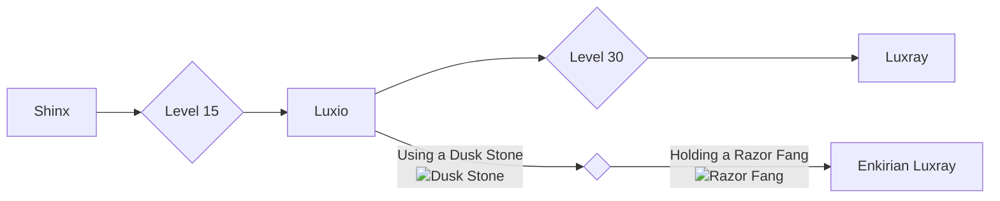

# 405 - Luxray

!!! note
    Information not listed on this page can be found on the Pixelmon Wiki of the base form of this species.

    [Base info :material-pokeball:](https://pixelmonmod.com/wiki/Luxray){: .md-button .md-button--primary target="_blank"}

<div class="grid" markdown>
Normal palette
{ width=150;}
{ .card }

Shiny palette
{ width=150;} 
{ .card }

</div>

## Entry
This Luxray variant evolved to thrive in Enkiria’s volcanic plains, where nights are long and skies often stormy. Unlike its regular form, it doesn't rely on sight—it detects movement through faint electrical pulses in the air. Its fangs carry a paralyzing current, and it prefers ambush tactics, striking from high rocks or dense underbrush. Rangers use its presence as a sign of a healthy but dangerous ecosystem.

### Category
Shadow Fang Pokémon

## Types
<div markdown="span">
{ width=100; align=left;}
{ width=100; align=right;}
</div>

## Evolutions




## Battle stats

=== "Graph"

    ```vegalite
    {
      "description": "Battle stats of the pokemon.",
      "data": {"url": "assets/pixelmon/luxray/battleStats.json"}
      ,
      "mark": {"type": "bar", "tooltip": true,"cornerRadiusEnd": 4},
      "encoding": {
        "y": {"field": "Stats", "type": "nominal", "axis": {"labelAngle": 0}},
        "x": {"field": "Power", "type": "quantitative"},
        "color": {"field": "Stats"}
      }
    }
    ```

=== "Table"

    {{ read_json('assets/pixelmon/luxray/battleStats.json') }}


Total: 523
                   
