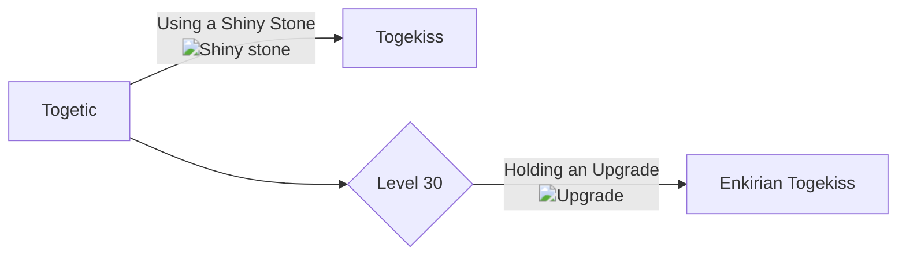

# 468 - Togekiss

!!! note
    Information not listed on this page can be found on the Pixelmon Wiki of the base form of this species.

    [Base info :material-pokeball:](https://pixelmonmod.com/wiki/Togekiss){: .md-button .md-button--primary target="_blank"}

<div class="grid" markdown>
Normal palette
{ width=150;}
{ .card }

Shiny palette
{ width=150;} 
{ .card }

</div>

## Entry
Enkirian Togekiss has evolved to harmonize with the rapidly growing digital age. Its wings are now laced with conductive alloy feathers, allowing it to manipulate electromagnetic waves to maintain flight. It is often seen gliding silently over cities, emitting calming white noise that soothe both humans and Pokémon alike.

### Category
Cyber Grace Pokémon

## Types
<div markdown="span">
{ width=100; align=left;}
{ width=100; align=right;}
</div>

## Evolutions



### Learning move

- [Flash Cannon](https://pixelmonmod.com/wiki/Flash_Cannon){:target="_blank"}

## Battle stats

=== "Graph"

    ```vegalite
    {
      "description": "Battle stats of the pokemon.",
      "data": {
        "values": [
          {"Stats": "Hp", "Power": 95}, 
          {"Stats": "Attack", "Power": 50},
          {"Stats": "Defense", "Power": 115},
          {"Stats": "Sp.Attack", "Power": 90},
          {"Stats": "Sp.Defense", "Power": 115},
          {"Stats": "Speed", "Power": 80}
        ]
    },
      "mark": {"type": "bar", "tooltip": true,"cornerRadiusEnd": 4},
      "encoding": {
        "y": {"field": "Stats", "type": "nominal", "axis": {"labelAngle": 0}},
        "x": {"field": "Power", "type": "quantitative"},
        "color": {"field": "Stats"}
      }
    }
    ```

=== "Table"

    {{ read_json('assets/pixelmon/togekiss/battleStats.json') }}


Total: 545


## Moves

=== "Level up"

    | Level |                                    Moves                                    | Replace (:octicons-check-16:) or Add (:octicons-x-16:) |
    | :---: | :-------------------------------------------------------------------------: | :----------------------------------------------------: |
    |  30  | [Flash Cannon](https://pixelmonmod.com/wiki/Flash_Cannon){:target="_blank"} |                  :octicons-x-16:                   |
                   
