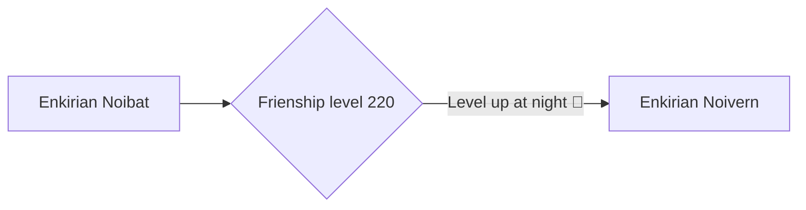

# 714 - Noibat

!!! note
    Information not listed on this page can be found on the Pixelmon Wiki of the base form of this species.

    [Base info :material-pokeball:](https://pixelmonmod.com/wiki/Noibat){: .md-button .md-button--primary target="_blank"}

<div class="grid" markdown>
Normal palette
{ width=150;}
{ .card }

Shiny palette
{ width=150;} 
{ .card }

</div>

## Entry
In the dense, misty jungles of Enkiria, Enkirian Noibat nests inside hollowed trees, emerging only at dusk. It uses the ultrasonic vibrations from its wings to locate prey and extract nectar-like fluids from giant insect husks. Travelers say its cries sound like whispers asking for permission to feed.

### Category
Leech Pokémon

## Types
<div markdown="span">
{ width=100; align=left;}
{ width=100; align=right;}
</div>

## Evolutions



### Learning move

- [Leech Life](https://pixelmonmod.com/wiki/Leech_Life){:target="_blank"}


## Battle stats

=== "Graph"

    ```vegalite
    {
      "description": "Battle stats of the pokemon.",
      "data": {"url": "assets/pixelmon/noibat/battleStats.json"}
      ,
      "mark": {"type": "bar", "tooltip": true,"cornerRadiusEnd": 4},
      "encoding": {
        "y": {"field": "Stats", "type": "nominal", "axis": {"labelAngle": 0}},
        "x": {"field": "Power", "type": "quantitative"},
        "color": {"field": "Stats"}
      }
    }
    ```

=== "Table"

    {{ read_json('assets/pixelmon/noibat/battleStats.json') }}

Total: 245