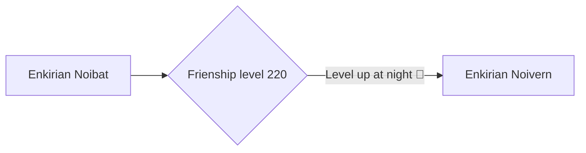

# 715 - Noivern

!!! note
    Information not listed on this page can be found on the Pixelmon Wiki of the base form of this species.

    [Base info :material-pokeball:](https://pixelmonmod.com/wiki/Noivern){: .md-button .md-button--primary target="_blank"}

<div class="grid" markdown>
Normal palette
{ width=150;}
{ .card }

Shiny palette
{ width=142;} 
{ .card }

</div>

## Entry
Feared in ancient Enkirian folklore, this nocturnal Pokémon was believed to bring omens of plague and storms. Its wings hum with a hypnotic resonance that lulls prey into stillness. Unlike its standard form, it feeds by piercing the carapace of large bug Pokémon, draining their vital essence in a ritualistic manner.

### Category
Vampire Drake Pokémon

## Types
<div markdown="span">
{ width=100; align=left;}
{ width=100; align=right;}
</div>

## Evolutions



### Learning move

- [Leech Life](https://pixelmonmod.com/wiki/Leech_Life){:target="_blank"}

## Battle stats

=== "Graph"

    ```vegalite
    {
      "description": "Battle stats of the pokemon.",
      "data": {"url": "../../assets/pixelmon/noivern/battleStats.json"}
      ,
      "mark": {"type": "bar", "tooltip": true,"cornerRadiusEnd": 4},
      "encoding": {
        "y": {"field": "Stats", "type": "nominal", "axis": {"labelAngle": 0}},
        "x": {"field": "Power", "type": "quantitative"},
        "color": {"field": "Stats"}
      }
    }
    ```

=== "Table"

    {{ read_json('../../assets/pixelmon/noivern/battleStats.json') }}

Total: 535