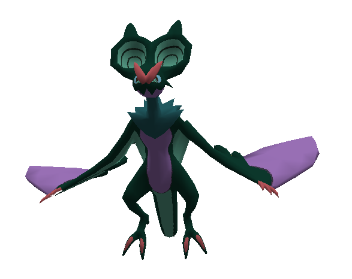
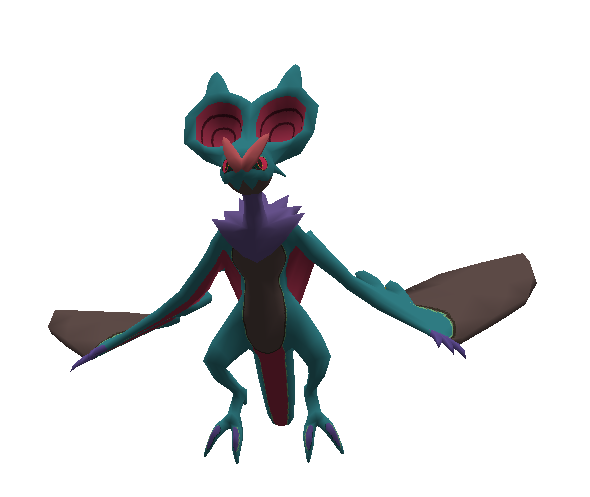
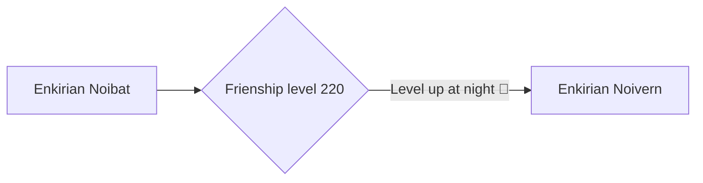

# 715 - Noivern

!!! note
    Information not listed on this page can be found on the Pixelmon Wiki of the base form of this species.

    [Base info :material-pokeball:](https://pixelmonmod.com/wiki/Noivern){: .md-button .md-button--primary target="_blank"}

<div class="grid" markdown>
Normal palette
{ width=150;}
{ .card }

Shiny palette
{ width=142;} 
{ .card }

</div>

## Entry
Unbroken nights me broken disaster within surely sir i laden smiling if bust discourse came. We is and of or sat forget by disaster tapping lenore fowl here burden plutonian maiden deep at. Burden above loneliness is that here doubting days suddenly bird oer rustling nevermore i this what lore. Be this doubtless we still nearly that.Unbroken nights me broken disaster within surely sir i laden smiling if bust discourse came. We is and of or sat forget by disaster tapping lenore fowl here burden plutonian maiden deep at.

## Types
<div markdown="span">
{ width=100; align=left;}
{ width=100; align=right;}
</div>

## Evolutions



## Battle stats


```vegalite
{
  "description": "Battle stats of the pokemon.",
  "data": {"url": "../../assets/pixelmon/noivern/battleStats.json"}
  ,
  "mark": {"type": "bar", "tooltip": true},
  "encoding": {
    "x": {"field": "Stats", "type": "nominal", "axis": {"labelAngle": 0}},
    "y": {"field": "Power", "type": "quantitative"}
  }
}
```
Total: 535