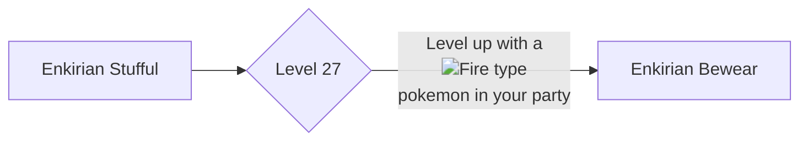

# 759 - Stufful

!!! note
    Information not listed on this page can be found on the Pixelmon Wiki of the base form of this species.

    [Base info :material-pokeball:](https://pixelmonmod.com/wiki/Stufful){: .md-button .md-button--primary target="_blank"}

<div class="grid" markdown>
Normal palette
{ width=150;}
{ .card }

Shiny palette
{ width=150;} 
{ .card }

</div>

## Entry
This curious and playful Pokémon has a faint warmth radiating from its fur. In the wild, Enkirian Stufful often nest near volcanic vents or sunlit stones. It’s drawn to the company of Fire-type Pokémon, instinctively mimicking their behavior, as if preparing for something greater.

### Category
Ember Cub Pokémon

## Types
<div markdown="span">
{ width=100; align=left;}
</div>

## Evolutions



### Learning move

- [Fire punch](https://pixelmonmod.com/wiki/Fire_Punch){:target="_blank"}

## Battle stats

=== "Graph"

    ```vegalite
    {
      "description": "Battle stats of the pokemon.",
      "data": {
        "values": [
          {"Stats": "Hp", "Power": 70}, 
          {"Stats": "Attack", "Power": 75},
          {"Stats": "Defense", "Power": 50},
          {"Stats": "Sp.Attack", "Power": 45},
          {"Stats": "Sp.Defense", "Power": 50},
          {"Stats": "Speed", "Power": 50}
        ]
      },
      "mark": {"type": "bar", "tooltip": true,"cornerRadiusEnd": 4},
      "encoding": {
        "y": {"field": "Stats", "type": "nominal", "axis": {"labelAngle": 0}},
        "x": {"field": "Power", "type": "quantitative"},
        "color": {"field": "Stats"}
      }
    }
    ```

=== "Table"

    {{ read_json('assets/pixelmon/stufful/battleStats.json') }}


Total: 340