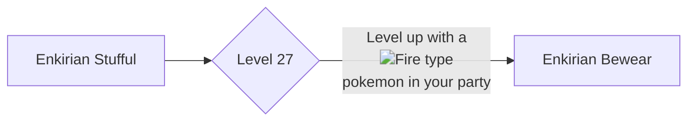

# 760 - Bewear

!!! note
    Information not listed on this page can be found on the Pixelmon Wiki of the base form of this species.

    [Base info :material-pokeball:](https://pixelmonmod.com/wiki/Bewear){: .md-button .md-button--primary target="_blank"}

<div class="grid" markdown>
Normal palette
{ width=150; }
{ .card }

Shiny palette
{width=130;}
{ .card }

</div>

## Entry
Upon evolving near a Fire-type companion, Enkirian Bewear’s inner heat ignites, awakening a powerful flame sac hidden in its chest. Its burning hugs are both healing and hazardous—capable of warming frostbitten allies or accidentally scorching its surroundings if it gets too emotional.

### Category
Ignition Hug Pokémon

## Types
<div markdown="span">
{ width=100; align=left;}
{ width=100; align=right;}
</div>

## Evolutions



### Learning move

- [Fire punch](https://pixelmonmod.com/wiki/Fire_Punch){:target="_blank"}

## Battle stats
=== "Graph"

    ```vegalite
    {
      "description": "Battle stats of the pokemon.",
      "data": {
        "values": [
          {"Stats": "Hp", "Power": 120}, 
          {"Stats": "Attack", "Power": 125},
          {"Stats": "Defense", "Power": 80},
          {"Stats": "Sp.Attack", "Power": 55},
          {"Stats": "Sp.Defense", "Power": 60},
          {"Stats": "Speed", "Power": 60}
        ]
      },
      "mark": {"type": "bar", "tooltip": true,"cornerRadiusEnd": 4},
      "encoding": {
        "y": {"field": "Stats", "type": "nominal", "axis": {"labelAngle": 0}},
        "x": {"field": "Power", "type": "quantitative"},
        "color": {"field": "Stats"}
      }
    }
    ```

=== "Table"

    {{ read_json('assets/pixelmon/bewear/battleStats.json') }}


Total: 500

## Moves

=== "Level up"

    | Level |                                    Moves                                    | Replace (:octicons-check-16:) or Add (:octicons-x-16:) |
    | :---: | :-------------------------------------------------------------------------: | :----------------------------------------------------: |
    |  16   | [Flame Charge](https://pixelmonmod.com/wiki/Flame_Charge){:target="_blank"} |                  :octicons-check-16:                   |
    |  36   |    [Fire Lash](https://pixelmonmod.com/wiki/Fire_Lash){:target="_blank"}    |                  :octicons-check-16:                   |
    |  60   |  [Flare Blitz](https://pixelmonmod.com/wiki/Flare_Blitz){:target="_blank"}  |                  :octicons-check-16:                   |


=== "Tm"

    - [Fire punch](https://pixelmonmod.com/wiki/Fire_Punch){:target="_blank"}