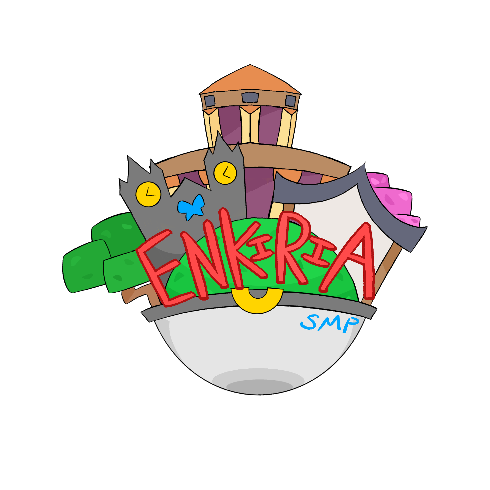
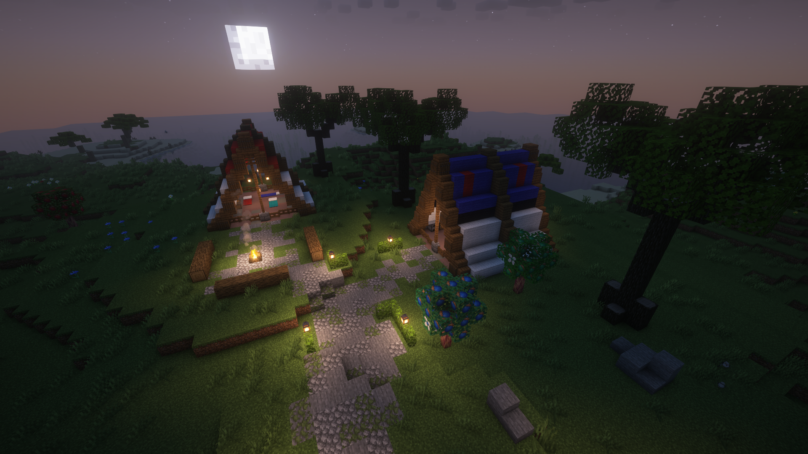

# Main Page

## Welcome to the Enkiria Region

{width=300; align=left}

!!! quote "A land where mythology, minerals, and modern marvels converge."
    Step into Enkiria, a vibrant and mysterious region forged in the heart of legend and stone. From high-tech cities built atop ancient ruins to deep caverns glowing with mystical gems, Enkiria is a land where the past and future intertwine — and where Pokémon are more than just companions; they are woven into the very fabric of the world.

    Trainers who journey here will uncover forgotten myths, **_encounter unique regional forms_**, and face challenges shaped by Enkiria's rich lore and rugged beauty. Whether you're researching arcane relics, battling in high-tech arenas, or exploring crystal-lined mountains, the region offers a truly immersive roleplay experience unlike any other.

    Forge your story. Uncover the truth. Welcome to Enkiria.

<figure markdown="span" >
  { width=720 }
  <figcaption>Spawn</figcaption>
</figure>

## Useful links

[Discord :simple-discord:](https://discord.gg/RUjgy7wKXr){: .md-button .md-button--primary target="_blank"}
[Pixelmon Wiki :material-pokeball:](https://pixelmonmod.com/wiki/Main_Page){: .md-button .md-button--primary target="_blank"}
[Curse Forge :simple-curseforge:](https://www.curseforge.com/download/app){: .md-button .md-button--primary target="_blank"}

 

:material-server: : enkiriapixelmon.mine.fun